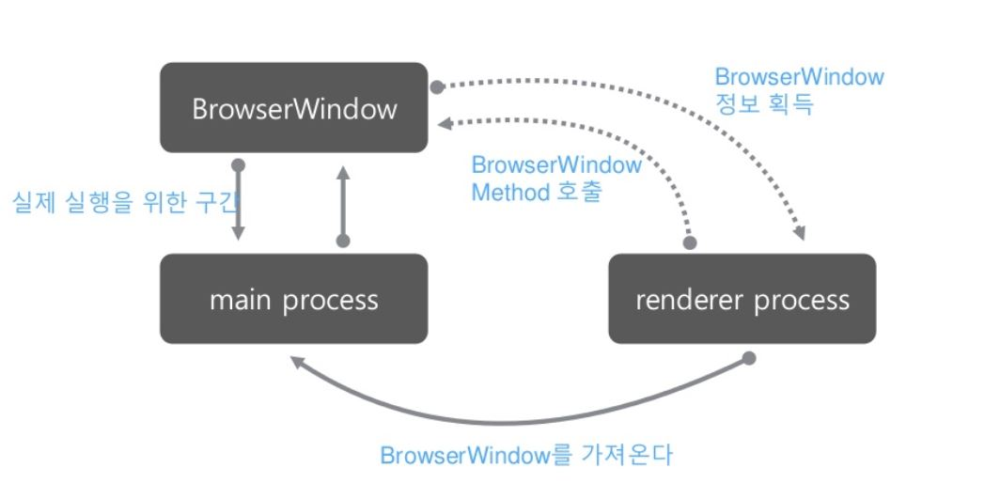

# Electron Tutorial

**Table of Contents**

- [Introduce](#Introduce)
- [Quick start](#Quick-start)
- [Inter process communication](#Inter-process-communication)
- [Usingu node modules](#Using-node-modules)
- [Application Packaging](#Application-Packaging)
- [Reference](#Reference)
- [Contributors](#Contributors)


## Introduce
Electron는 GitHub에서 HTML, CSS 및 JavaScript를 사용하여 데스크톱 응용 프로그램을 개발하기 위해 
개발된 오픈 소스 라이브러리다. Electron 은 Chromium과 Node.js를 단일 실행으로 합치고 앱을 
Mac, Windows 와 Linux 용으로 패키지화 하여 사용가능하게 한다.

- Electron 구조


### main process
Electron이 실행될 때 Node.js가 실행되는 부분을 main process라고 한다. main process는 새창을 
생성하거나 윈도우, 맥, 리녹스의 네이티브 GUI를 조작할 수 있으며, Node.js에서 사용하는 모듈을 사용할 수 있다.   
</br>
사용자에게 보여지는 GUI를 구성할 때 작동하는 웹페이지를 renderer process라고 한다. renderer process는 
네이티브 리소스에 접근할 수 없으며, 크로미움을 사용하여 사용자에게 보여주는 화면을 구성한다.      
</br>
하나의 main process에서 다수의 renderer process를 관리하며, renderer process는 각각이 독립적으로 작동하고
단일 페이지의 작동에만 영향을 준다. Electron의 BrowserWindow 클래스를 통해 main process에서 redererperocess를
생성할 수 있다. BrowserWindow 클래스를 통해 생성된 인스턴스가 소멸할 때 renderer process도 같이 소멸된다.

## Quick start
- 먼저 Electron 모듈을 설치한다.
```bash
$ npm init -y
$ npm install electron --save-dev --save-exact
$ npm install electron -g 
```
- github에서 제공하는 electron-quick-start를 사용해도 된다.
```bash
$ git clone https://github.com/electron/electron-quick-start
$ cd electron-quick-start
$ npm install
$ npm start
```

- main.js 생성 후 BrowserWindow 클래스를 통해 인스턴스 생성
```javascript
const {app, BrowserWindow} = require('electron')
const path = require('path')
const url = require('url')

//윈도우 객체의 전역으로 선언합니다. 그렇지 않으면 윈도우가 자동으로 닫는다.
//자바 스크립트 객체가 가비지 수집 될 때 자동으로 닫는다.
let win

function createWindow () {
  // 브라우저 창을 만듭니다.
  win = new BrowserWindow({width: 800, height: 600})

  //index.html를 로드합니다.
  win.loadURL(url.format({
    pathname: path.join(__dirname, 'index.html'),
    protocol: 'file:',
    slashes: true
  }))

  // 개발툴을 사용하기 위해 오픈한다.
  win.webContents.openDevTools()

  // 윈도우가 닫힐 때 발생되는 이벤트다.
  win.on('closed', () => {
    win = null
  })
}

//사용 준비가 완료되면 윈도우를 연다.
app.on('ready', createWindow)

// 모든 창이 닫히면 종료한다.
app.on('window-all-closed', () => {
  if (process.platform !== 'darwin') {
    app.quit()
  }
})

app.on('activate', () => {
  // macOS에서 독 아이콘이 클릭되고 다른 창은 열리지 않는다.
  if (win === null) {
    createWindow()
  }
})
```

- renderer process에서  표시하려는 웹페이지(index.html)를 만든다.
```html
<!DOCTYPE html>
<html lang="en">
<head>
    <meta charset="UTF-8">
    <title>Hello Electron</title>
</head>
<body>
    <h1>Hello Electron!</h1>
</body>
</html>
```

- Electron App 실행
```bash
$ ./node_modules/.bin/electron main.js
$ electron index.js
```

## Inter process communication

#### ipcMain
#### ipcRenderer

## Using node modules

## Application Packaging

## Reference
- https://electronjs.org/docs
- https://www.slideshare.net/deview/123-electron

## Contributors
- 오형석[(wellstone@hanbat.ac.kr)](wellstone@hanbat.ac.kr)
- 한밭대학교 무선통신소프트웨어 연구실 NRF-IoT-Platform 연구팀

<br/>
Hanbat National University Wisoft Laboratory